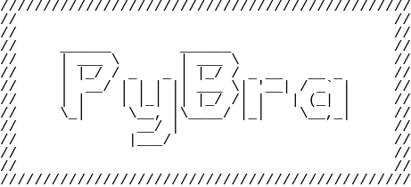

<p align="center">
  
</p>

## Description
PyBra is a Fast
 Brainf#ck Language **Interpreter** , designed to simulate Brainfuck tape dynamics translate & generate random brainfu*k codes , Decode and Encode in BF, and more . 

## Installation
To install PyBra Tool, you can either use :    

 ```bash
  $pip install pybra
  ```
**Or**
- Clone the repository:   `git clone https://github.com/dev-mokhtar/Softwares/PyBra`

-  Navigate to the PyBra directory: 
  `cd PyBra`
-  Install required dependencies: 
  `pip install -r dependecies `


## Usage
just use :
```bash
  $./Pybra.py --help 
  ```

## Contributing
If you want to contribute to PyBra, fork it and submit a pull request ! 

## IDE
 - The IDE Will Be Available Soon 

## License
PyBra is licensed under MIT License 
